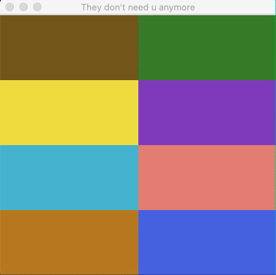

# Assignment
- Modify your button GUI program so that the buttons change color, automatically, about every second unless they've been pressed.
# Demo

### Comparision to Previous Assignment

| HW 2 | HW 3 |
| :-: | :-: |
|  |  |

