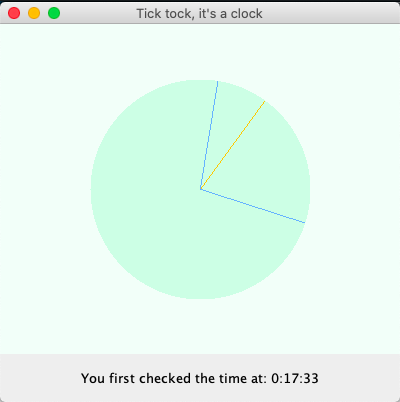
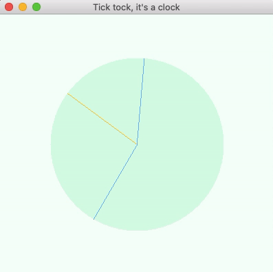

# Instructions
Using the code we did in class today, create a program which displays an analog clock with hours, minutes and seconds.  You do not need to label the clock, just the hands will be good enough. 

As you know, the sleep function is imprecise, so you should, periodically, update the time from from the NIST by connecting a socket to [time-a-g.nist.gov](time-a-g.nist.gov) on `port 13`. (**Note:** DO NOT REQUEST THE TIME MORE OFTEN THAN ONCE PER MINUTE!!!!). The DayTime Protocol is in use and is documented [here](https://tools.ietf.org/html/rfc867).  Don't worry about adjusting for UTC, you can use that value directly (right now it is Eastern Time +4 hours).

Main `.java` file can be found [here](https://github.com/mkarroqe/Java-CS3913/blob/master/HW5_Analog_Clock/src/com/example/hw5_analog_clock/HW5_Analog_Clock.java).

# Demo
|  |  |
| - | - |
